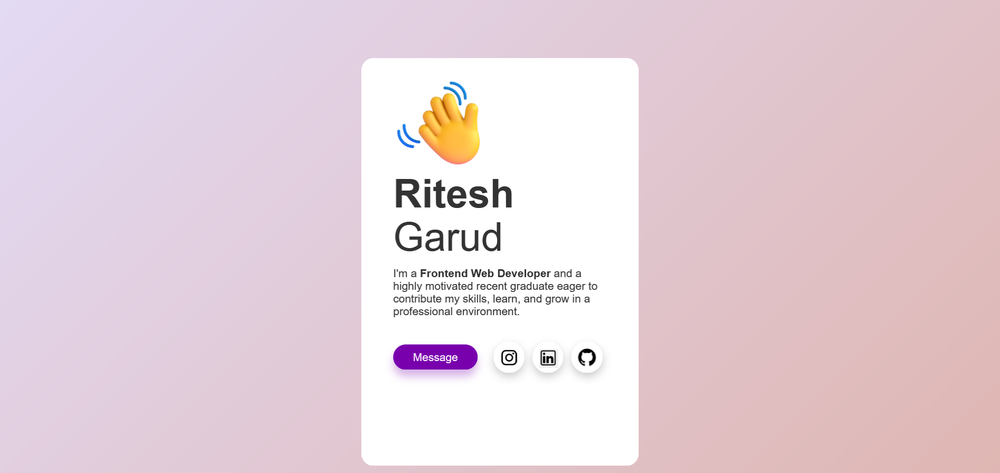
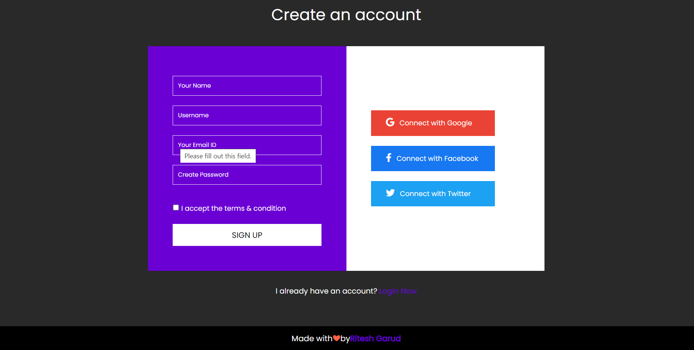

# Minor Project Repository

Welcome to the Minor Project Repository! This repository contains a collection of minor projects created using HTML and CSS. These projects are designed to help you learn and practice web development skills while creating visually appealing web pages.

## Table of Contents

- [Projects](#projects)
- [Installation](#installation)
- [Usage](#usage)
- [Contributing](#contributing)
- [License](#license)

## Projects

### 1. Profile Card

Description: This is a simple project for creating a "Profile Card" using HTML and CSS. The profile card displays basic information about a person, such as their name, job title, and a brief description, and it is styled with CSS to create an attractive and visually appealing card.

</a>
</a>

### 2. Contact Us Form

Description: This is a simple project for creating a "Contact Us" form using HTML and CSS. It allows users to send inquiries or messages to the website's administrators. The form includes fields for name, email, phone, and a message, and it is styled with CSS to make it visually appealing.

</a>

### 3. Sign Up Page

Description: This project provides a simple and stylish sign-up page created using HTML and CSS. It allows users to register for an account with basic information.

</a>

## Installation

1. Clone this repository to your local machine:

   git clone https://github.com/yourusername/Minor-Project.git

2. Navigate to the project directory:

   cd Minor-Project

## usage

1. Explore the individual project folders to view the HTML and CSS code for each project.

2. Open the index.html files in your preferred web browser to view the projects locally.

3. ou can customize and modify these projects as you see fit, or use them as a learning resource to improve your HTML and CSS skills.

## Contributing

If you'd like to contribute to this project, feel free to fork the repository and submit pull requests with your changes. We welcome any improvements or additional features.

1. Fork the repository.

2. Create a new branch for your feature or bug fix:

   git checkout -b feature/your-feature

3. Make your changes and commit them:

   git commit -m "Add your feature"

4. Push your changes to your fork:

   git push origin feature/your-feature

5. Create a pull request from your fork to the main repository.

## License

This project is licensed under the MIT License. You are free to use and modify the code as you see fit for your own projects.

You can use this README as a starting point for your "Minor Project Repository." Be sure to replace the placeholders with actual links and information specific to your project repository.

